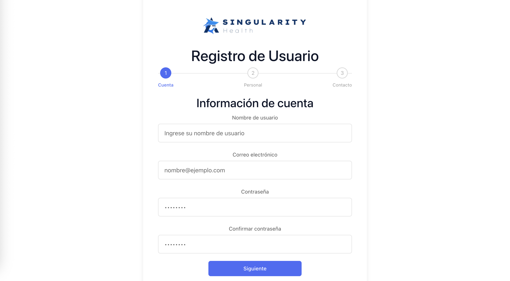
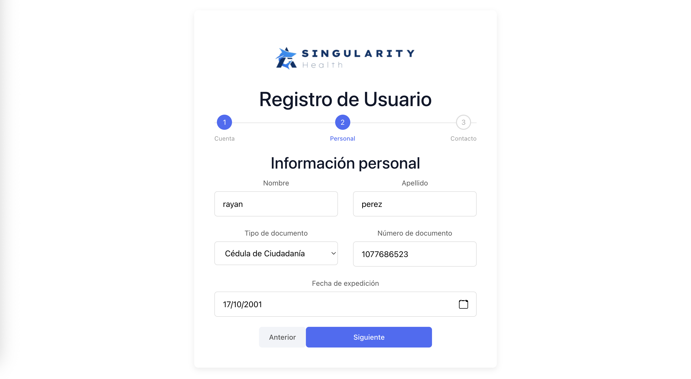
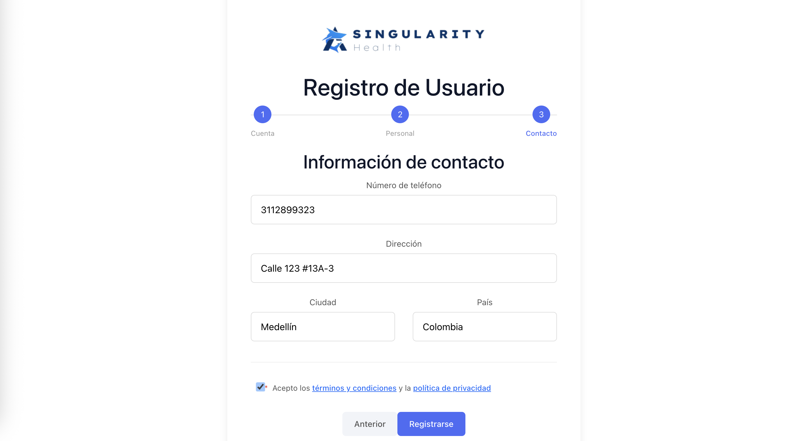
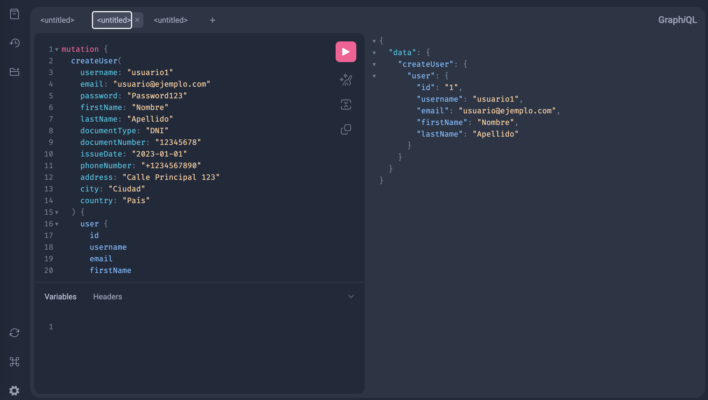
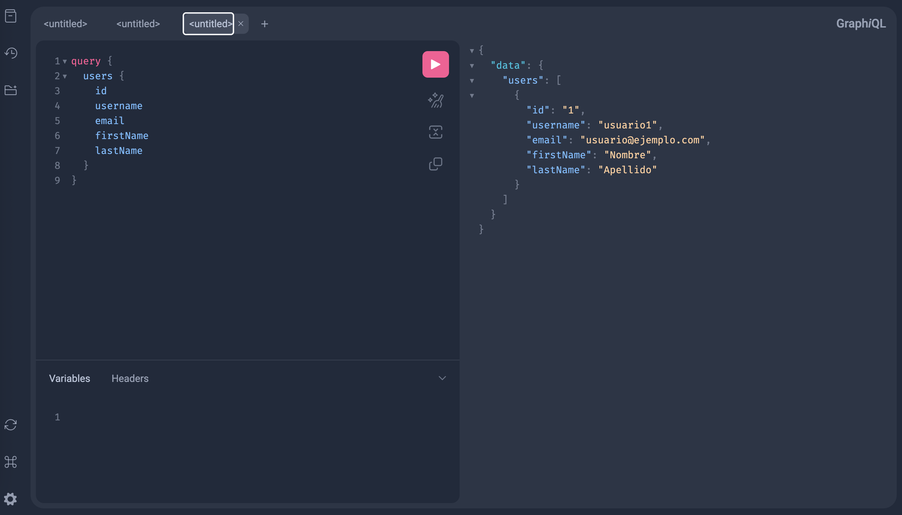

# Singularity Health - Sistema de Registro de Usuarios

<p align="center">
  
  
</p>

## Descripción del Proyecto

Este proyecto es una solución a la prueba técnica para Desarrollador Backend en Singularity Health, que consiste en un sistema completo de registro de usuarios con validación de datos y persistencia usando GraphQL. El sistema está compuesto por un backend desarrollado con Django y GraphQL, y un frontend desarrollado con React.

## Características Principales

- **API GraphQL**: Implementación completa para la persistencia de datos
- **Modelos de datos relacionados**: Usuario, Documento de Identidad, Contacto
- **Validaciones robustas**: Validación de datos en backend y frontend
- **Interfaz de usuario moderna**: Diseñada con React y Bootstrap
- **Seguridad**: Contraseñas encriptadas y validaciones de datos

## Tecnologías Utilizadas

### Backend

<p align="left">
  
  
  
  
</p>

- Django
- Graphene-Django (GraphQL)
- Django CORS Headers
- BCrypt (para encriptación de contraseñas)
- AWS

### Frontend

<p align="left">
  
  
  
</p>

- React
- Bootstrap
- React-Toastify (notificaciones)
- Vite (bundler)

### Base de datos

<p align="left">
  
  
  
</p>

- MySQL - AWS aurora and RDS

### Despliegue

<p align="left">
  
  
</p>

- Cloudflare Pages CI/CD

## Enlaces del Proyecto

| Recurso                   | URL                                                                                 | Descripción                                  |
| ------------------------- | ----------------------------------------------------------------------------------- | -------------------------------------------- |
| 🌐 **Aplicación Web**     | [Singularity Health App](https://singularity-health.pages.dev/)                     | Formulario de registro para usuarios finales |
| 🔍 **API GraphQL**        | [Endpoint GraphQL](https://1afs3bt7ti.execute-api.us-east-1.amazonaws.com/graphql/) | Endpoint para consultar y enviar datos (Sin servicio para evitar costo)       |
| 🛠️ **GraphQL Playground** | [Hygraph](https://hygraph.com/graphql-playground)                                   | Herramienta para probar consultas GraphQL    |

## Requisitos Previos

<p align="left">
  
  
  
  
</p>

- Python 3.8+
- Node.js 18+
- npm o yarn

## Instalación y Configuración

### Backend

1. Navega al directorio del backend:

   ```
   cd backend
   ```

2. Crea un entorno virtual e instala las dependencias:

   ```
   python -m venv venv
   source venv/bin/activate  # En Windows: venv\Scripts\activate
   pip install -r requirements.txt
   ```

3. Ejecuta las migraciones:

   ```
   python manage.py migrate
   ```

4. Inicia el servidor:
   ```
   python manage.py runserver 7007
   ```
   El servidor estará disponible en http://127.0.0.1:7007/

### Frontend

1. Navega al directorio del frontend:

   ```
   cd frontend-health/app
   ```

2. Instala las dependencias:

   ```
   npm install
   ```

3. Inicia el servidor de desarrollo:
   ```
   npm run dev
   ```
   La aplicación estará disponible en http://localhost:5173/

## Estructura del Proyecto

### Backend

<details>
<summary>📁 Estructura de archivos</summary>

```
users/                  # Aplicación principal
├── models.py           # Modelos de datos (Usuario, Documento, Contacto)
├── schema.py           # Definición de tipos y mutaciones GraphQL
└── ...

singularity_health/     # Configuración del proyecto
├── settings.py         # Configuración general
├── urls.py             # Rutas URL
├── schema.py           # Esquema GraphQL principal
└── ...
```

</details>

### Frontend

<details>
<summary>📁 Estructura de archivos</summary>

```
src/
├── components/
│   └── auth/
│       └── UserRegistration.jsx  # Formulario de registro
├── services/
│   └── graphqlService.js         # Cliente GraphQL
└── ...
```

</details>

## Uso del Sistema

### API GraphQL 🚀

La API GraphQL está disponible en:

- Local: http://127.0.0.1:7007/graphql/
- Producción: https://1afs3bt7ti.execute-api.us-east-1.amazonaws.com/graphql/

<details>
<summary>📝 Ejemplos de consultas</summary>

#### Crear un Usuario

```graphql
mutation {
  createUser(
    username: "usuario1"
    email: "usuario@ejemplo.com"
    password: "Password123"
    firstName: "Nombre"
    lastName: "Apellido"
    documentType: "DNI"
    documentNumber: "12345678"
    issueDate: "2023-01-01"
    phoneNumber: "+1234567890"
    address: "Calle Principal 123"
    city: "Ciudad"
    country: "País"
  ) {
    user {
      id
      username
      email
      firstName
      lastName
    }
  }
}
```

#### Consultar Usuarios

```graphql
query {
  users {
    id
    username
    email
    firstName
    lastName
  }
}
```

</details>

### Interfaz de Usuario 💻

La aplicación frontend proporciona un formulario de registro intuitivo con validaciones en tiempo real. El formulario está dividido en secciones para facilitar la entrada de datos:

1. **📋 Información Personal**: Nombre de usuario, correo electrónico, contraseña, nombre y apellido
2. **🪪 Documento de Identidad**: Tipo de documento, número y fecha de expedición
3. **📞 Información de Contacto**: Teléfono, dirección, ciudad y país

## Validaciones Implementadas ✅

- **📧 Email**: Formato válido y unicidad
- **👤 Nombre de usuario**: Mínimo 4 caracteres y unicidad
- **🔑 Contraseña**: Mínimo 8 caracteres, al menos una mayúscula, una minúscula y un número
- **🪪 Documento**: Unicidad de la combinación tipo y número
- **📞 Teléfono**: Formato válido

## Seguridad 🔐

<p align="left">
  
  
</p>

- Contraseñas encriptadas con BCrypt
- Validaciones en backend y frontend
- Protección CSRF en las peticiones

## Licencia

<p align="left">
  
</p>

Este proyecto es de código abierto y está disponible bajo la Licencia MIT.

## Autor

<p align="left">
  
</p>

Desarrollado como prueba técnica para Singularity Health.

## Capturas de Pantalla

A continuación se muestran algunas capturas de pantalla del sistema:

### Formulario de Registro



### Validación de Datos


### Información de Contacto



### Registro Exitoso



### Panel de Administración



### Interfaz de GraphQL



### Deploy


